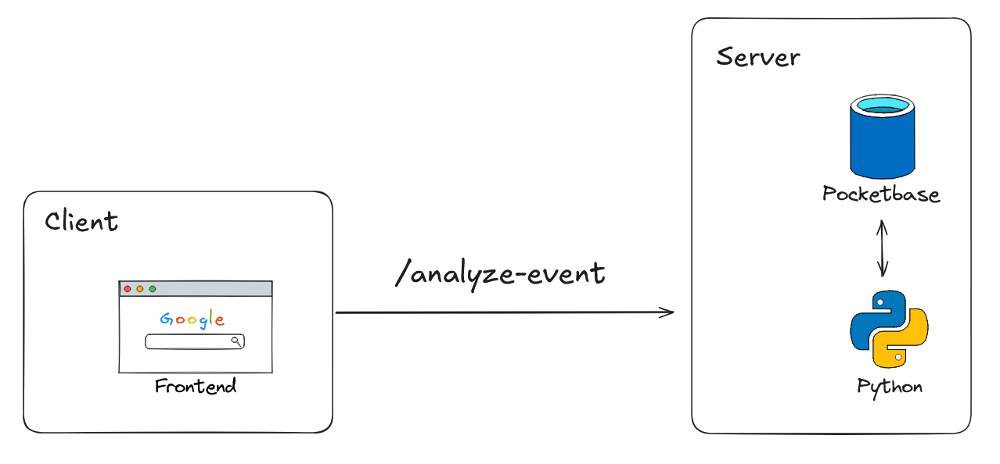
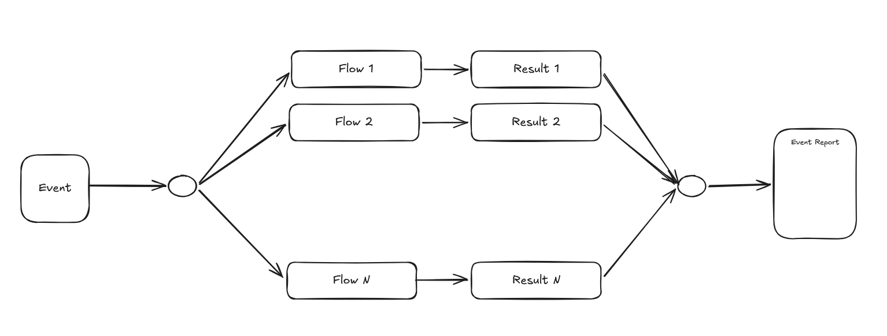

# Overview

## Frontend
TypeScript React homepage with an event textbox, analysis submission, and a
search input (search results are not implemented). The browser calls
`POST /api/analyze-event`; the development/preview proxy forwards this to the
backend's `/analyze-event` using `VITE_API_URL`. Production requires the same proxy
rewrite. Homepage colors are configurable in `frontend/src/colors.css`.

## Backend
FastAPI exposes `POST /analyze-event`, accepting JSON with a non-empty `text`
string. It trims the text and currently returns
`{"status":"ok","results":{"risks":[],"reach":[],"service":[]}}`.
Each workflow's list may contain zero, one, or multiple matches, each with `ID`
and display `name`. Invalid text returns HTTP 422.

The lifespan loads a configurable Transformers tokenizer and base model once
per server process into `app.state.runtime`. `MODEL_ID` selects a Hugging Face
model or local directory; `MODEL_DEVICE=auto|cpu|cuda` selects its device.
Each server worker loads its own model. CPU and CUDA 12.8 dependency profiles
are managed with uv extras; see [backend setup](backend/README.md).

`workflows.py` defines independent workflow functions and the `WORKFLOWS` registry.
The risk, reach, and service workflows each use their own Swedish system prompt
and the matching category file in `backend/schemas/`. Each evaluates all of its
IDs and descriptions in one Gemma generation call, reusing the same processor and
model instance. The registry runs the workflows in order and combines their results. Definitions
are validated once at startup; returned IDs are validated and mapped to display
names. A shared runtime lock serializes model access across requests and workflows.
Inputs exceeding 8192 tokens return HTTP 413; invalid model output or inference
failures return HTTP 502; unsupported model runtimes return HTTP 503.

The frontend still expects the scaffold's `not_implemented` response and needs a
future update to consume the results. PocketBase persistence remains unimplemented;
the diagram below describes the intended architecture.

## Pocketbase
Data layer using Pocketbase, serving using Go. 

Collections
- Events (event_id, group_id: nullable, text)
- Analysis ()
